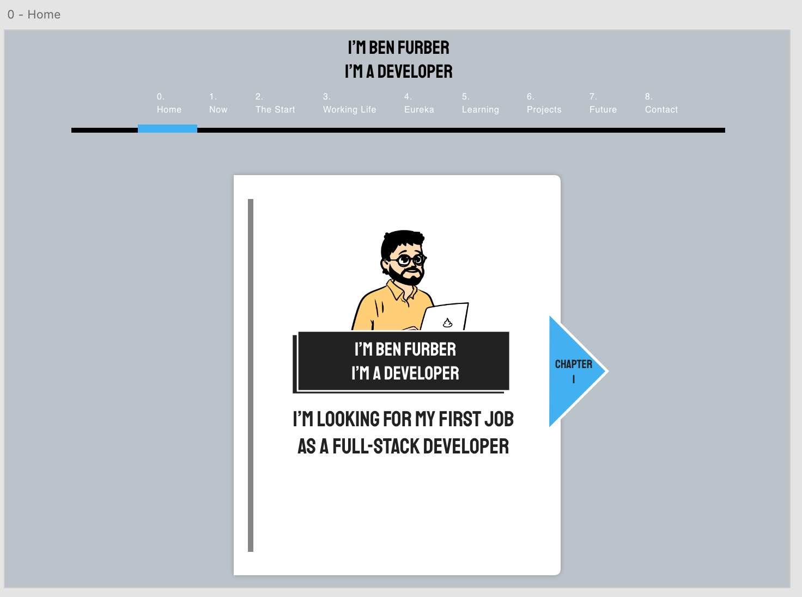
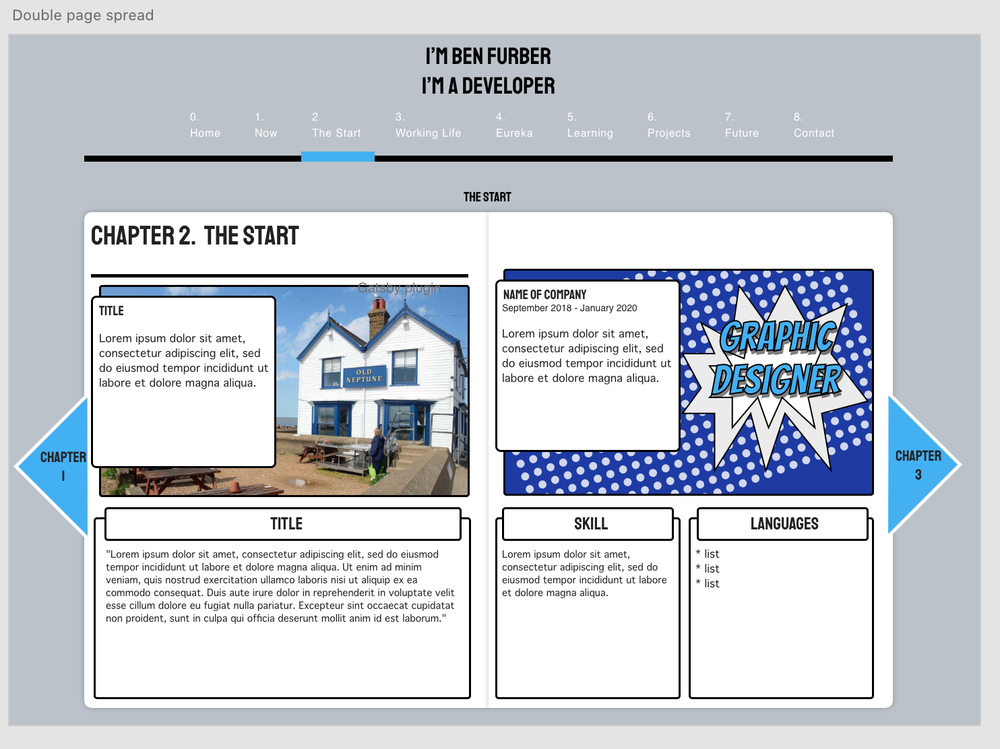

# Story CV

This project provides a customisable template for developers to demonstrate their potential.

This project was bootstrapped with [Gatsby](https://www.gatsbyjs.com/)

## :arrow_up: How to Setup

Step 1: git clone this repo:

Step 2: cd to the cloned repo:

Step 3: Install the Application with yarn or npm i

## Dependencies installed

| Dependency                    | Description                                                                   |
| ----------------------------- | ----------------------------------------------------------------------------- |
| bootstrap                     | Front-end open source toolkit that makes it easy to build responsive sites    |
| gatsby                        | React-based open source framework                                             |
| gatsby-plugin-sass            | Gatsby plugin to handle scss/sass files.                                      |
| gatsby-plugin-web-font-loader | Gatsby plugin to asynchronously load webfonts using Web Font Loader.          |
| gatsby-transformer-remark     | Gatsby plugin to parse Markdown files using [Remark](https://remark.js.org/). |

Testing and development dependencies

| Dependency              | Description                                                                                        |
| ----------------------- | -------------------------------------------------------------------------------------------------- |
| @types/jest             | Contains type definitions for Jest                                                                 |
| enzyme                  | A JavaScript Testing utility for React that makes it easier to test your React Components' output. |
| enzyme-adapter-react-16 | An adapter which corresponds to current version of enzyme. Required to install enzyme.             |
| jest                    | Testing framework                                                                                  |
| prettier                | An opinionated code formatter                                                                      |
| ts-jest                 | TypeScript preprocessor enables the use of Jest to test projects written in TypeScript             |
| typescript              | Adds static type definitions to JavaScript                                                         |

## Design

**Front cover**

**Double Page Spread**

